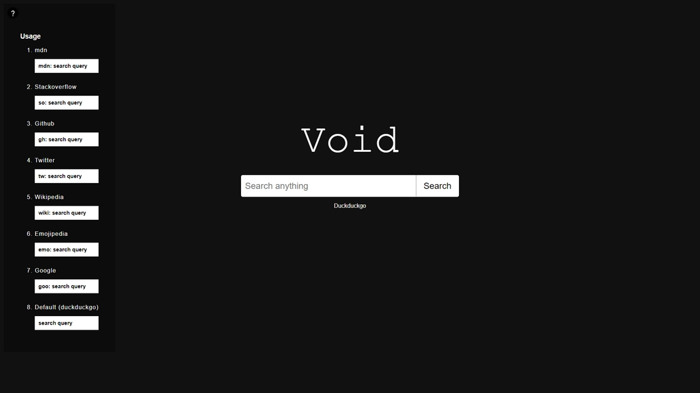
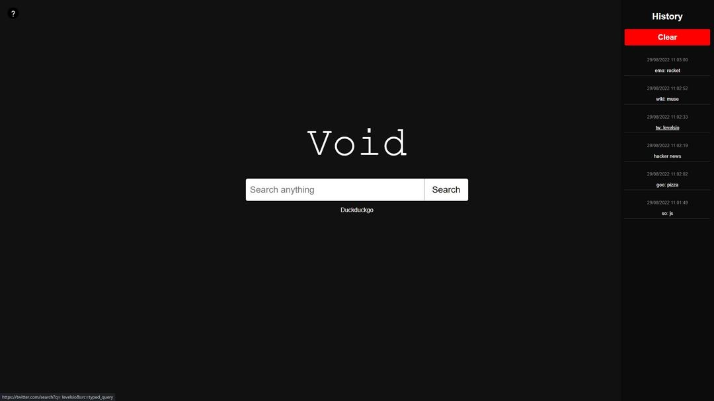

# Void • Search everywhere

## What about it?

I wanted one searchbar to search on multiple website i like.

 

## Philosophy

- Keep it stupid simple
- No library

 

## Stack

- HTML / CSS
- Vanilla JavaScript

 

## Search queries

<ol>
    <li>mdn</li>
    
mdn: {query}

    <li>Stackoverflow</li>
    
so: {query}

    <li>Github</li>
    
gh: {query}

    <li>Twitter</li>
    
tw: {query}

    <li>Wikipedia</li>
    
wiki: {query}

    <li>Emojipedia</li>
    
emo: {query}

    <li>Google</li>
    
goo: {query}

    <li>Default (duckduckgo)</li>
    
{query}

</ol>

 

## Features

 

### On the left side you can learn the usage if you're hovering the question mark.

 

 

### Hover the right side, and you can see your history

 

  
Feel free to fork the project and add features.
